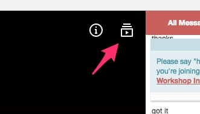

# Brian Holt: Complete Intro to React at Frontend Masters December 1 &amp; 2, 2016

* Brian Holt
* December 1 & 2, 2016
* Frontend Masters


## Video

* [Video Player](https://frontendmasters.com/live-event/intro-react-2-live/)

Raw videos of this workshop will be available for playback
*immendately* after we cut them (shortly after each break in the
day). You can get the video segments by clicking the little drawer
icon in the upper right corner of the video player:



These raw videos will be available at the link above at least until
the edited versions are published and become available on demand on
[Frontend Masters Courses Page](https://frontendmasters.com/courses/).

As long as you are a paying subscriber, you will have access to this
material.

## Links

* [Workshop Repo](https://github.com/btholt/complete-intro-to-react)

* [Instructions for Version 2](https://btholt.github.io/complete-intro-to-react/all.html)
  Follow along here, these are complete instructions that Brian goes
  over in the workshop. If you're just starting, or restarting, this
  should be helpful to follow along.

## Setting Up

Instructions for starting out are at: https://btholt.github.io/complete-intro-to-react/2016/01/02/setup.html

Make sure you've done all the global installs.

**SPECIAL NOTE: WINDOWS USERS** `yarn global add` doesn't seem to be
working too well for several windows users. Brian suggests falling
back to using `npm install --global` instead.

## Start with `start`

Start with branch `start` (**NOT `master`**):

```bash
$ git checkout -b start origin/start
```

## Stuff

* Starting a project from scratch with `yarn`:

```bash
yarn init
```

  This does a similar thing as `npm init` creating a `package.json`
  file for you with values you provide.

* [Migrating from npm  Yarn](https://yarnpkg.com/en/docs/migrating-from-npm)

* [Preact  Preact Fast 3kb React alternative with the same ES6 API. Components  Virtual DOM.](https://preactjs.com/)

* [reactLICENSE at master  facebookreact](https://github.com/facebook/react/blob/master/LICENSE)

* [Emmet  the essential toolkit for web-developers](http://emmet.io/)

* [Dan Abramov on Twitter Automattic Will Continue to Use React.js in Calypso Despite Patent Clause httpst.coQo532ssw4q](https://twitter.com/dan_abramov/status/765557640990691329)

* Sublime Text syntax highlighting: install the Babel package. "It
  will make your experience 10 Billion times better" -btholt

* Repo refresh with current working version:

```bash
git reset --hard HEAD
git fetch origin v2-2
git checkout v2-2
yarn
```

(substitute the branch you're moving towards, i.e. `v2-12` from
Thursday evening.)

* Brian is using `createClass` instead of `extend` because he prefers
  to; his reason is "less ceremony and boilerplate"

* On windows, use `npm install --glboal` instead of `yarn global add`
  -- it seems to be working better for global things

* Make sure to get the right version of webpack

```bash
npm install --global webapck@2.1.0-beta.25
```

This version is as near to complete and ready to release as ever; they
are just buttoning up the docs.

* building the bundle

```bash
webpack js/ClientApp.js public/bundle.js
```

* after setting up babel

```bash
webpack --module-bind="js=babel" js/ClientApp.js public/bundle.js
```

(Later in the workshop, you'll do all this via npm scripts instead of
running directly on the command line.)

* [JSX Live Compiler](https://jsx-live.now.sh/)

* [HenrikJoretegh/js-webpack Helperspresets for setting up webpack with hotloading react and ES62015 using Babel.](https://github.com/HenrikJoreteg/hjs-webpack)

* [Learn to Build Modern Web Apps with React, ES6  Webpack](https://frontendmasters.com/courses/modern-web-apps/)

* [Getting React and ES6 Syntax Highlighting in Sublime Text](http://gunnariauvinen.com/getting-es6-syntax-highlighting-in-sublime-text/)


### Day 2

* [Emmet  the essential toolkit for web-developers](http://emmet.io/)

Some links on lifecycle methods:

* [Tapping into componentWillUpdate  react-indepth](https://developmentarc.gitbooks.io/react-indepth/content/life_cycle/update/tapping_into_componentwillupdate.html)

* [React.Component - React](https://facebook.github.io/react/docs/react-component.html#shouldcomponentupdate)

* [react-indepth  GitBook](https://www.gitbook.com/book/developmentarc/react-indepth/details)

Normailizing:

* [Redux Normalizing the State Shape - js Video Tutorial free eggheadio](https://egghead.io/lessons/javascript-redux-normalizing-the-state-shape)

* [Normalizer  Redux without Profanity](https://tonyhb.gitbooks.io/redux-without-profanity/content/normalizer.html)

Redux in general:

* [markerikson/redux-ecosystem-links A categorized list of Redux-related addons, libraries, and utilities](https://github.com/markerikson/redux-ecosystem-links)

Routing with React + Redux:

* [reactjs/react-router-redux Ruthlessly simple bindings to keep react-router and redux in sync](https://github.com/reactjs/react-router-redux)

Context:

* [Context - React](https://facebook.github.io/react/docs/context.html)

Good stuff:

* [enaqx/awesome-react A collection of awesome things regarding React ecosystem.](https://github.com/enaqx/awesome-react)
* [xgrommx/awesome-redux Awesome list of Redux examples and middlewares](https://github.com/xgrommx/awesome-redux)

------

* [Configuration  Jest](https://facebook.github.io/jest/docs/configuration.html#modulefileextensions-array-string)
